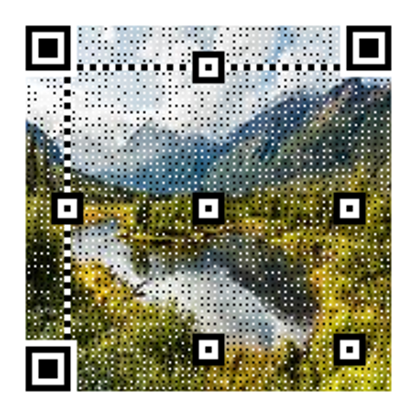

# Introduction
This is the repository for class project1 of *DigitalCircuit 2020*, *IIIS Tsinghua*. This project contains a QR code generator and a QR code decoder written in Python.

Please run *setup.bat* for environment setup. 

# Usage
## QRCodeGenerator
*./QRCodeGenerator/QRCodeGenerator.py* contains two fuctions for generating QR code. 

*GenerateQRCode()* can generate plain QR code image given input text. 

*GenerateQRCodeWithBGD()* can generate QR code with image or gif background given input text. 

## QRDecoder
*./QRDecoder/QRDecoder.py* contains *DecodeQR()* that can decode QR code images or gifs into text.

# Example
Example input can be found in *./test\_input*, output can be found in *./test\_output*

## Input1

## Output1

## Input2

## Output2

